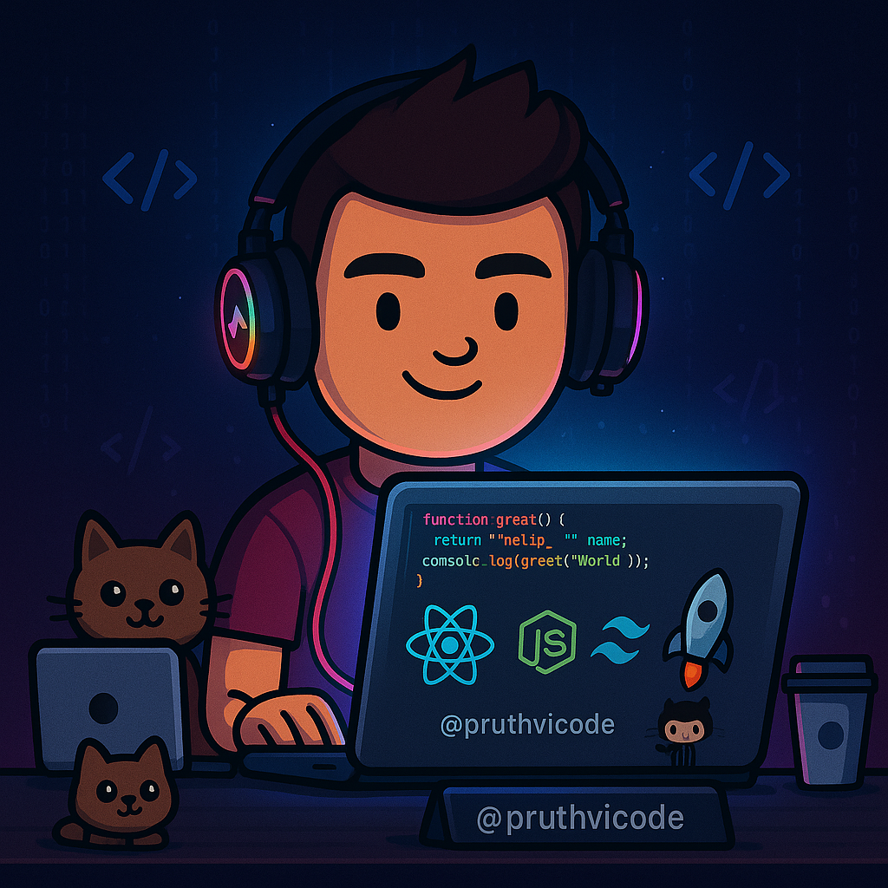

<h1 align="center">Hey 👋, I'm Pruthvi Sawant</h1>
<h3 align="center">A tech enthusiast, passionate developer, and curious learner exploring the world of full-stack development</h3>

<table>
  <tr>
    <td style="min-width: 200px; vertical-align: top;">
      <h3>🚀 About Me</h3>
      <ul>
        <li>🔭 Currently building: <strong>Sparkels_ui</strong></li>
        <li>🌱 Learning: <strong>MERN Stack | DSA & Algorithms</strong></li>
        <li>💼 Portfolio: <a href="https://portfolio-main-xot1.vercel.app/">Visit My Projects →</a></li>
        <li>📫 Reach me at: <strong>sawantpruthviraj1@gmail.com</strong></li>
      </ul>
    </td>
    <td style="width: 50%;">
      
    </td>
  </tr>
</table>

### 🔗 Connect with Me

  
  
  

---

### 🛠️ Tech Stack & Tools

  
  
  
  
  
  
  
  
  
  
  
  
  
  
  
  
  
  
  
  
  
  
  

---

### 📊 GitHub Stats

  

<!-- Optional: Use a customized stats card like the one in the image (requires third-party tools like GitHub Readme Stats Card Generator) -->

---

### ⚡ Fun Fact

> I may call myself a part-time script kiddie, but I strive every day to become a full-time problem solver 😄

---

